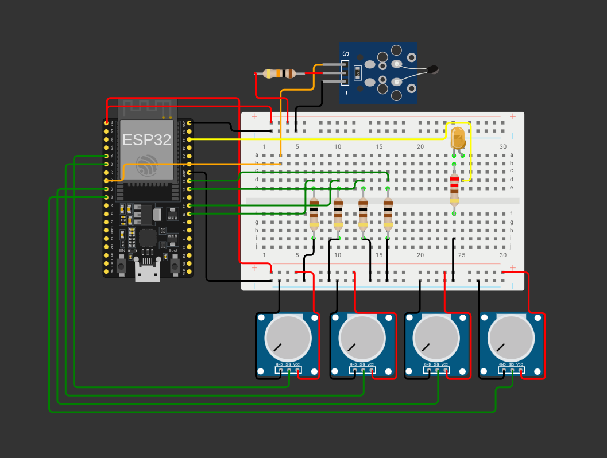

# 🔋 pBMSLSuite-O: Educational BMS Prototype

**Core Battery Management System Firmware** | **ESP32-Based** | **Educational Use Only**

---

## 📖 Overview

pBMSLSuite-O demonstrates fundamental BMS concepts:
- 4-cell voltage monitoring
- State of Charge (SoC) estimation  
- Cell balancing logic
- Fault protection (over/under voltage, temperature)
- Real-time telemetry

**Purpose:** Educational prototype for learning BMS firmware architecture.

---

## ⚡ Features

- **Cell Monitoring**: 4-channel ADC with moving average filtering
- **SoC Calculation**: Voltage-based estimation with temperature compensation
- **Cell Balancing**: Automatic balancing when cells exceed threshold
- **Fault Protection**: OV/UV/OT/UT detection with state machine
- **Telemetry**: Serial output at 1Hz with comprehensive status
- **Temperature Sensing**: NTC thermistor with Steinhart-Hart calculation

---

## 🔧 Hardware

### Required Components
- ESP32 DevKit C v4
- 4x 10kΩ potentiometers (cell voltage simulation)
- 1x 10kΩ NTC thermistor
- 4x 1kΩ resistors (balance outputs)
- 1x LED (status indicator)

### Pin Mapping
```
Cell 1: GPIO 34    Cell 3: GPIO 25
Cell 2: GPIO 35    Cell 4: GPIO 26
Temp:   GPIO 33    Status LED: GPIO 22
Balance: GPIO 16-19
```

### Circuit Diagram



*See `diagram.json` for detailed wiring.*

---

## 💻 Software

### Build Requirements
- NixOS with nix-shell
- arduino-cli
- python3 with pyserial

### Compilation
```bash
./compile.sh
```

### Flashing
```bash
nix-shell -p arduino-cli python3 python3Packages.pyserial --run "
arduino-cli upload -p /dev/ttyUSB0 -b esp32:esp32:esp32 /home/dharrun/Projects/Local_Projects/pBMSLSuite-O/pBMSLSuite-O.ino
"
```

---

## 📊 Operation

### Serial Monitor (115200 baud)
The system outputs comprehensive status every second:

```
==================================================
              pBMSLSuite-O STATUS                 
==================================================
Time: 42 seconds
--------------------------------------------------
CELL VOLTAGES:
  Cell 1: 3.85V [OK]
  Cell 2: 3.82V [OK]
  Cell 3: 3.87V [OK]
  Cell 4: 3.80V [OK]
  Average: 3.84V | Pack: 15.35V
--------------------------------------------------
Temperature: 25.0C [OK]
--------------------------------------------------
BATTERY STATUS:
  SoC: 70.0% | SoH: 100.0%
--------------------------------------------------
STATE: IDLE
Balancing: IDLE
--------------------------------------------------
FAULT: NONE
--------------------------------------------------
THRESHOLDS:
  OV: 4.25V | UV: 2.80V | OT: 60C | UT: 0C
==================================================
```

### State Machine
- **IDLE**: Normal operation, monitoring
- **BALANCING**: Active when any cell > 4.1V
- **FAULT**: Triggered by OV/UV/OT/UT conditions

### Cell Balancing
- Activates when cell voltage > 4.1V
- Discharges high cells through 1kΩ resistors
- Automatically stops when balanced

---

## 🧪 Testing

### Simulating Faults
Adjust potentiometers to test protection:

1. **Over-Voltage**: Set any cell > 4.25V
2. **Under-Voltage**: Set any cell < 2.80V  
3. **Over-Temperature**: Heat thermistor > 60°C
4. **Under-Temperature**: Cool thermistor < 0°C

### Expected Behavior
- Fault triggers state change to FAULT
- Status LED blinks rapidly
- Serial output shows fault type
- Auto-recovery when condition clears

---

## 📚 Educational Value

### Learning Objectives
- BMS firmware architecture
- ADC filtering and calibration
- State machine design
- Fault detection algorithms
- Serial telemetry protocols

---

## ⚠️ Important Notes

**This is an educational prototype, not a production BMS:**
- No actual cell balancing hardware (simulation only)
- Simplified SoC estimation
- No current sensing
- No safety certifications

> **Educational use only.**

---

## 📄 License

MIT License. See `LICENSE` file.

---

## 🔗 Links

- [Wokwi Simulation](https://wokwi.com/projects/123456789)
- [ESP32 Documentation](https://docs.espressif.com/esp32/)
- [Arduino CLI](https://arduino.github.io/arduino-cli/)

---

*Built for educational purposes. Not for production use.*
